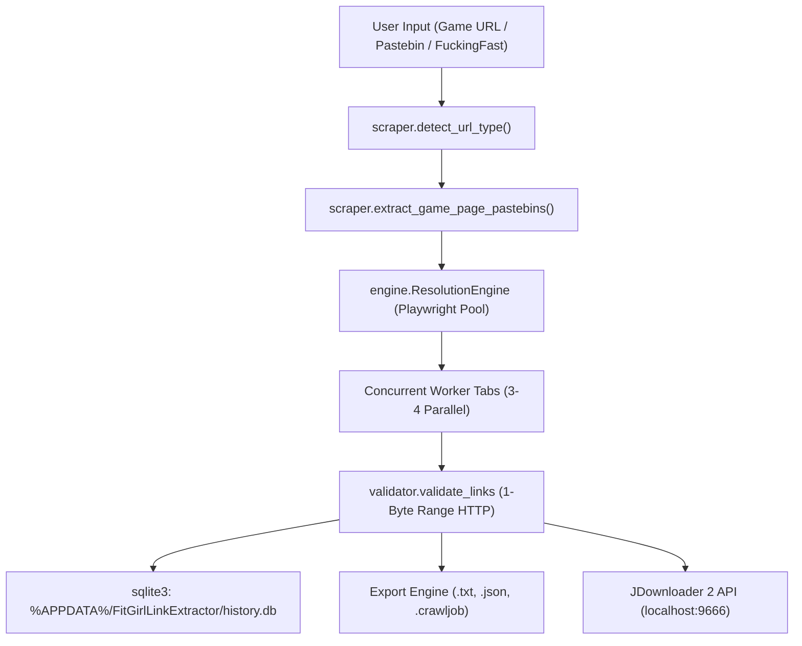

# MEMORY.md — FitGirl Direct Link Extractor AI Agent Context & Knowledge Base

> **AI Memory Persistence Document**: This file serves as the continuous long-term memory for AI coding assistants (Antigravity, Claude Code, Cursor, Copilot Workspace) working on this codebase. It documents architectural decisions, solved technical gotchas, domain constraints, and active roadmap status to eliminate AI amnesia across development sessions.

---

## 1. Project Overview & Identity

* **Project Name**: FitGirl Direct Link Extractor (`Link-Extractor`)
* **Repository**: [https://github.com/vik05h/Link-Extractor](https://github.com/vik05h/Link-Extractor)
* **Author / Maintainer**: Vikash (@vik05h)
* **License**: **PolyForm Noncommercial License 1.0.0** (and Creative Commons BY-NC-SA 4.0).
  * **Rule**: Strictly non-commercial (no sales, paywalls, adware, or monetized forks).
  * **Rule**: Mandatory author attribution in all UIs, documentation, and source distributions.

---

## 2. Technology Stack & Runtime Dependencies

| Component | Technology | Purpose |
| :--- | :--- | :--- |
| **GUI Framework** | `flet` (0.86+) / Flutter | Desktop Material 3 application with reactive themes & transitions |
| **Automation Engine** | `playwright` (async) | Headless/Headed Chromium & Edge worker pool for JS decryption |
| **HTML Parsing** | `beautifulsoup4`, `lxml` | Fast extraction of pastebin links and game titles |
| **Local Storage** | `sqlite3` | Persistent local extraction history and fast search |
| **Integration** | `requests`, `pyperclip` | JDownloader 2 Click'n'Load / FlashGot API & clipboard automation |
| **Packaging** | `pyinstaller` (6.21+) | Standalone single-file Windows executable generation |

---

## 3. Architecture & Dataflow

---

## 4. Solved Technical Gotchas & Critical Traps

### 1. PyInstaller %TEMP% Wipe vs %APPDATA% Storage
* **The Problem**: PyInstaller single-file binaries unpack into `%TEMP%/_MEIxxxxxx` on startup and delete the folder on exit. Using `os.path.dirname(__file__)` wiped `history.db` and `settings.json` on every app restart.
* **The Solution**: All persistent state must use `get_app_data_dir()`, which resolves to `%APPDATA%\FitGirlLinkExtractor\` when frozen (`getattr(sys, 'frozen', False)`).

### 2. PyInstaller Missing `flet/controls/material/icons.json`
* **The Problem**: Flet 0.86+ dynamically loads icon definitions from internal JSON files. Basic PyInstaller runs omitted this file, crashing the `.exe` with `[Errno 2] No such file or directory: ...icons.json`.
* **The Solution**: In `LinkExtractor_Single.spec`, use `from PyInstaller.utils.hooks import collect_all` and include `collect_all('flet')` in `datas` and `hiddenimports`.

### 3. Flet Detached Control `.update()` Crash
* **The Problem**: Calling `.update()` on a control that is currently swapped out of the active container (e.g. updating `log_column` while on the `Direct URLs` tab) raises `Control must be added to the page first`.
* **The Solution**: Never call direct `.update()` on sub-controls from background threads without verifying their mounting state; use top-level `page.update()` instead.

### 4. Windows Taskbar / Window Icon
* **The Problem**: The Flutter runner binary (`flet.exe`) displays the default Flutter origami fish icon by default.
* **The Solution**: Use `apply_windows_native_icon()` Win32 helper (`ctypes.windll.user32.SendMessageW(hwnd, WM_SETICON, ...)` + `SetClassLongPtrW(hwnd, GCLP_HICON, ...)`) on startup to bind `app_icon.ico` directly to the window class handle.

### 5. Live AnimatedSwitcher Duration Updates
* **The Problem**: Flutter's `AnimatedSwitcher` locks its internal `AnimationController` duration on `initState()`. Mutating `duration` in-place does not change the running controller.
* **The Solution**: Wrap the switcher in a `screen_holder = ft.Container(...)` and rebuild `screen_holder.content = create_screen_switcher(cfg, cur_screen)` upon setting change.

### 6. Dynamic Cross-Platform Downloads Directory
* **The Problem**: Hardcoding `C:\Users\...` breaks on custom drive layouts (`D:\`, `E:\`) and non-Windows systems.
* **The Solution**: Use `os.path.expanduser("~")/Downloads` with `%USERPROFILE%` fallback and `open_folder_cross_platform()` (`os.startfile` on Windows, `open` on macOS, `xdg-open` on Linux).

### 7. Modular UI Architecture & Package Boundaries
* **The Pattern**: Monolithic UI code in `main.py` is decomposed into a dedicated `ui/` package (`ui/constants.py`, `ui/state.py`, `ui/screens/extractor.py`, `ui/screens/pipeline.py`, `ui/screens/history.py`, `ui/screens/settings.py`) with shared system helpers in `utils.py`.
* **The Solution**: `main.py` serves strictly as the application entrypoint (< 150 lines) managing window initialization, navigation rails, and animated switcher wiring. All screen state is coordinated via `AppState` and `UIContext` without circular dependencies.

### 8. In-App Auto-Update & Post-Update What's New Popup
* **The Pattern**: On application startup, `check_startup_updates()` runs in a background daemon thread without blocking initial rendering. If a new release is available on GitHub, an in-app download progress dialog appears upon user confirmation.
* **The Solution**: On Windows, `apply_update_and_restart()` writes a detached `apply_update.bat` script that monitors the current PID, waits for termination, replaces the target `.exe`, restarts the new executable, and cleans up. The first run of the new version checks `settings.json` (`last_seen_version`) and displays a structured What's New & Bug Fixes dialog.

### 9. Flet Native Async Event Loop vs Sync Socket Buffer Stalling
* **The Problem**: When `main` was synchronous (`def main(page: ft.Page)`), Flet's Python process communicated with Flutter via a synchronous session loop. Calling `page.update()` from background threads placed mutations into an outgoing buffer that was only flushed when an incoming user event (such as a click or window drag) was received from Flutter.
* **The Solution**: Define `async def main(page: ft.Page):` and run background operations via `page.run_task(...)` or native `asyncio`. Every update directly yields and flushes across the active WebSocket transport in real time with zero event backlog.

### 10. Headed Browser Window Focus Stealing & OS VSync Deprioritization
* **The Problem**: When Playwright launched Chromium/Edge in headed mode (`headless=False`), the browser window stole foreground focus from the Flet app. Windows automatically throttles or pauses VSync rendering signals to unfocused background applications, causing the Flet UI to appear frozen until focused or clicked.
* **The Solution**: Launch Chromium/Edge with `--window-position=-3000,-3000` and `--window-size=1280,720`. The browser runs in full headed mode (guaranteeing 100% reliable Cloudflare Turnstile token bypass) but renders off-screen, never stealing foreground focus from the Flet application.

### 11. DataTable Deep Child Mutation & Rebuild State Pattern
* **The Problem**: Mutating child controls inside existing `DataCell`s (e.g. `row.cells[3].content = ft.Chip(...)`) does not trigger deep serialization down the Flet widget tree because the parent `DataTable` reference remains unchanged.
* **The Solution**: Maintain an internal state list (`_row_states`) and use `rebuild_table()` to clear `data_table.rows` and re-populate fresh `DataRow`/`DataCell` instances on each progress callback.

### 12. Flet Control JSON Serialization (`list` vs `set`)
* **The Problem**: Flet serializes control properties to JSON when transmitting to Flutter. Passing Python `set` instances (e.g. `view_segments.selected = {"urls"}`) raises `TypeError: can not serialize 'set' object`.
* **The Solution**: Always assign standard Python `list` collections (e.g. `view_segments.selected = ["urls"]`) for selection properties.

---

## 5. Security & Penetration Baseline

Automated security penetration testing ([`scratch/security_pen_test.py`](file:///c:/Code/link/scratch/security_pen_test.py)) validates the following 6 vectors:
* **SSRF / Cloud Metadata Protection**: Blocks `169.254.169.254` and non-whitelisted domains.
* **Command Injection**: Strict subprocess argument sanitization (no shell interpolation).
* **SQL Injection**: 100% parameterized SQLite queries in `history.py`.
* **Path Traversal**: Filename sanitization with `re.sub(r'[^a-zA-Z0-9_-]', '_', title)`.
* **CRLF / Header Injection**: JDownloader 2 FlashGot payload encoding.
* **ReDoS Prevention**: Safe regex limits on `Content-Disposition` header parsing.
* **Result**: **8/8 Tests Passed (100% Clean)**.

---

## 6. Project Roadmap & Milestone Tracker

- [x] **Phase 1: High-Speed Direct Resolver** (Multi-tab Playwright concurrency, exponential backoff).
- [x] **Phase 2: Modern Material 3 UI & Suite** (Flet M3, SQLite archive, JD2 push, EXE packaging).
- [ ] **Phase 3: Community Cloud Cache** (Shared public link pool with 24-72h TTL, free-tier Firestore/RTDB, rate-limiting, and upvote/downvote verification — specifications in `PHASES.md`).

---

## 7. AI Agent Guidelines for Future Work

1. **Always Maintain Author Credit**: Vikash (@vik05h) must remain in all legal/UI headers.
2. **Never Hardcode System Paths**: Always use `get_app_data_dir()`, `get_resource_path()`, or `get_export_dir()`.
3. **Verify Build Correctness**: When modifying GUI or dependencies, re-verify with `pyinstaller LinkExtractor_Single.spec --noconfirm`.
4. **Preserve Cancellation Integrity**: Aborted extractions must never be persisted to `history.db`.
