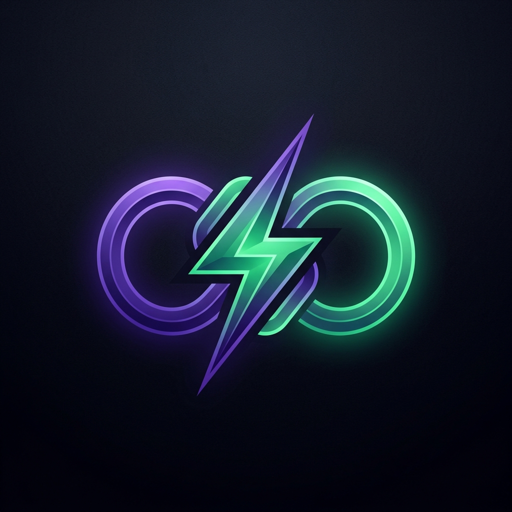
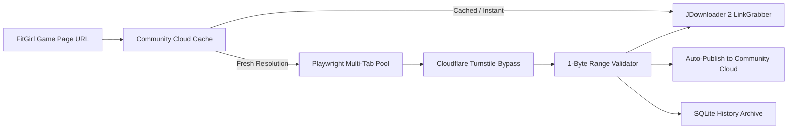
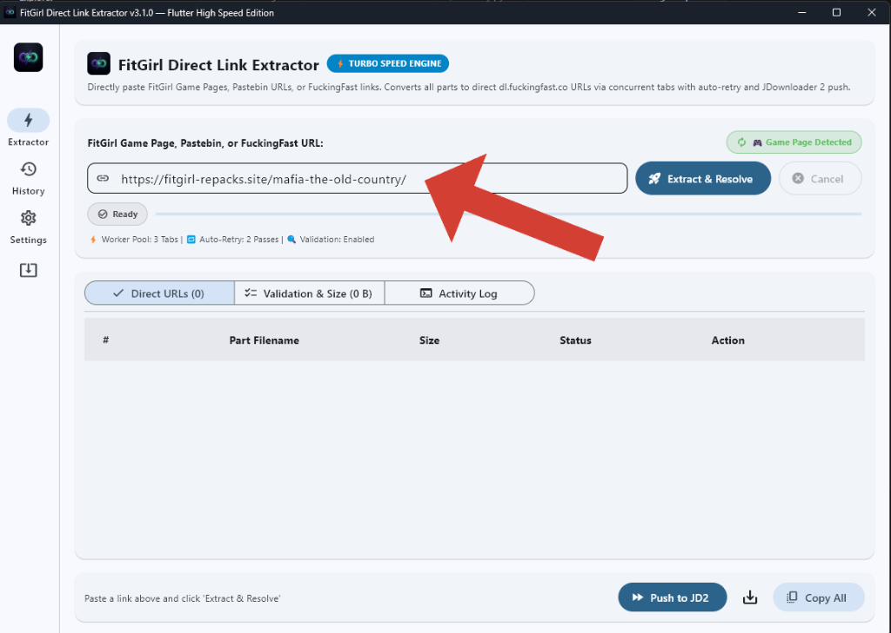
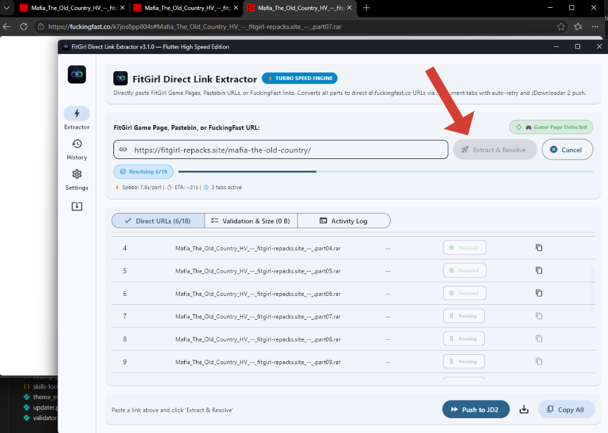
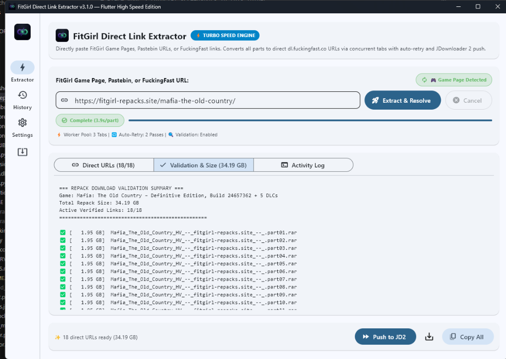
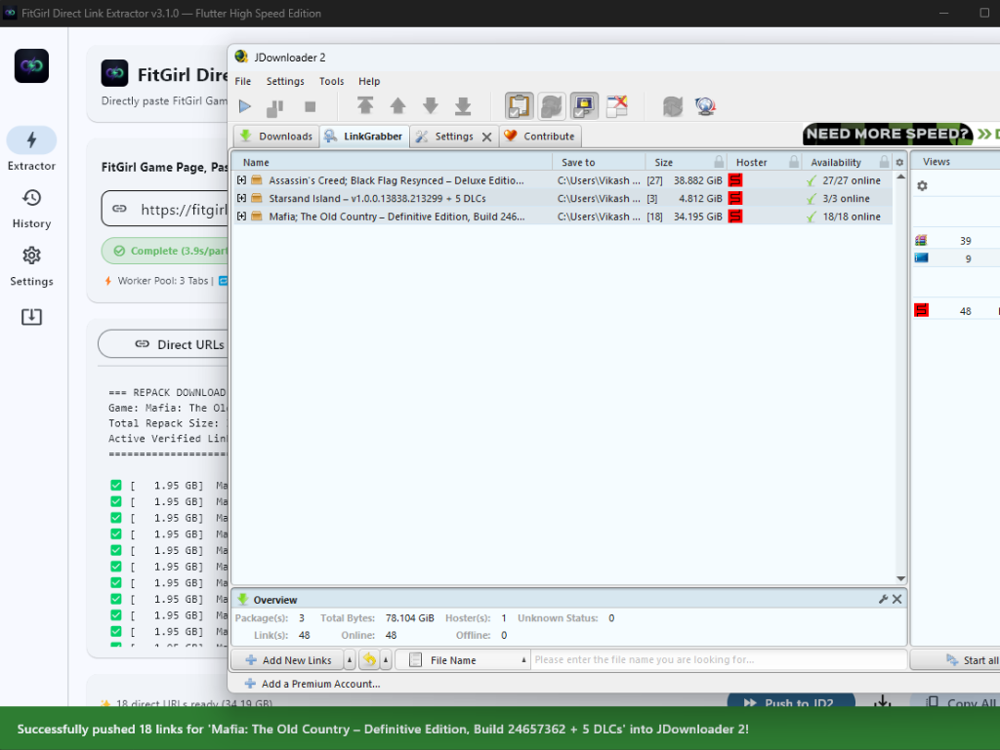
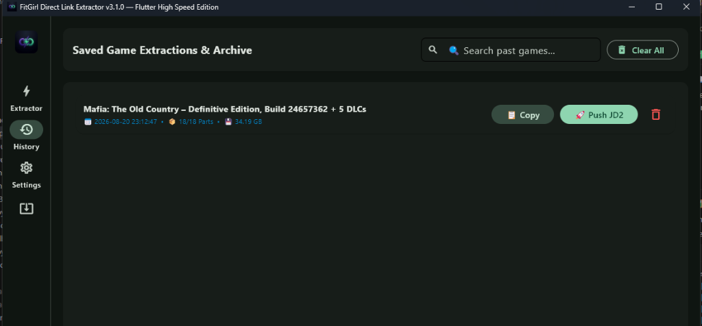

<p align="center">
  
</p>

<h1 align="center">FitGirl Direct Link Extractor</h1>

<p align="center">
  <b>High-speed multi-threaded direct link resolver and JDownloader 2 automation tool for FitGirl repacks.</b>
</p>

<p align="center">
  <a href="LICENSE"></a>
  <a href="https://creativecommons.org/licenses/by-nc-sa/4.0/"></a>
  <a href="https://www.python.org/downloads/"></a>
  <a href="https://flet.dev"></a>
  <a href="https://github.com/vik05h/Link-Extractor/releases"></a>
</p>

---

## Why This Tool Exists

When downloading large games (such as Black Myth: Wukong with 195 parts or Assassin's Creed with 27 parts), navigating through pastebins and solving Cloudflare Turnstile captchas on every part takes 30–45 minutes of manual clicking.

Furthermore, feeding raw fuckingfast.co links to JDownloader 2 often triggers captcha errors or Deep Link Analysis prompts because direct tokens lack file extensions.

**FitGirl Link Extractor automates the entire pipeline:**
1. Paste a single FitGirl game page URL.
2. Community Cloud Cache automatically checks for pre-fetched links from other users to download instantly in 0 seconds.
3. If not cached or resolving fresh, the multi-tab worker pool automatically solves Cloudflare Turnstile in parallel (~1.8s/part).
4. Outputs **100% verified direct download links** (`dl.fuckingfast.co`) and pushes them straight into JDownloader 2 with one click.

---

## Key Highlights



- **Community Cloud Cache & Shared Link Hub (Phase 3)**: Instant decentralized link sharing powered by Firebase Realtime Database lightweight REST API. Skip browser automation entirely when games are already resolved.
- **Pixel Dino Arcade Loading Animation**: Retro 8-bit arcade Pixel Dino running loader with live cloud status updates.
- **3D-Styled Game Cards with Local Timezone Intelligence**: Game cover thumbnails, depth lighting, localized timestamps (e.g. `21 Aug 2026, 05:25 PM IST`), freshness badges, and 4 quick actions (`Use Instant`, `Push JD2`, `Copy URLs`, `Health Check`).
- **Concurrent Tab Pool (3x–6x Speedup)**: Resolves multiple game parts simultaneously inside a shared browser context.
- **Material 3 UI (Flutter Engine)**: Smooth 60–120 FPS animations, Navigation Rail, live interactive DataTable, and 5 dynamic color palettes.
- **Instant 1-Byte Size Validation**: Computes exact total repack download sizes and verifies live filenames using lightweight 1-byte HTTP range requests.
- **Zero-Prompt JDownloader 2 Push**: Dual-channel integration (FlashGot HTTP API on port 9666 + `.crawljob` auto-import) with `#filename.rar` anchors so JDownloader recognizes files instantly.
- **Embedded History & Archive**: Searchable local SQLite database (`history.db`) for 1-click re-copying and re-pushing past extractions.
- **GitHub Releases Auto-Updater & In-App Installer**: Automatically checks for updates on startup, downloads and applies updates in-app upon user confirmation, and displays a What's New & Bug Fixes changelog on updated launches.

---

## Speed Benchmarks

| Repack Game | Total Parts | Manual Browser Time | FitGirl Link Extractor (3 Tabs) | Community Cloud Cache (Instant) | Time Saved |
| :--- | :---: | :---: | :---: | :---: | :---: |
| **Starsand Island** | 3 Parts | ~2.5 mins | **~6.2 seconds** | **~0.2 seconds** | **99% Faster** |
| **Mafia: The Old Country** | 18 Parts | ~14 mins | **~38 seconds** | **~0.3 seconds** | **99% Faster** |
| **Assassin's Creed: Black Flag** | 27 Parts | ~20 mins | **~54 seconds** | **~0.3 seconds** | **99% Faster** |
| **Black Myth: Wukong** | 195 Parts | ~1.5 hours | **~5.5 minutes** | **~0.5 seconds** | **99.9% Faster** |

---

## Step-by-Step Visual Tutorial

Follow this quick guide to resolve and download any FitGirl repack in seconds:

### Step 1: Paste Your Link & Community Detection
Paste any FitGirl game page URL, Pastebin link, or direct FuckingFast URL. The app checks the Community Cloud Cache and alerts you if pre-fetched direct links exist with 1-click instant loading.

<p align="center">
  
  <br>
  <em>Figure 1: URL input with real-time detection badge.</em>
</p>

---

### Step 2: Multi-Tab Parallel Resolution
Click **Extract & Resolve**. If resolving fresh, the Playwright multi-tab pool resolves multiple parts concurrently (~1.8s per part) and streams live progress into the dashboard.

<p align="center">
  
  <br>
  <em>Figure 2: Real-time progress bar, worker stats, and direct links streaming.</em>
</p>

---

### Step 3: Verified Direct URLs & Repack Sizing
Inspect all extracted `dl.fuckingfast.co` URLs in the interactive DataTable, complete with part numbers, live sizes (e.g. `18/18 Parts (34.19 GB)`), and validation status.

<p align="center">
  
  <br>
  <em>Figure 3: Interactive DataTable showing direct URLs with verified file hashes.</em>
</p>

---

### Step 4: 1-Click JDownloader 2 Push or File Export
- Click **Push to JD2** to send the entire package directly into JDownloader 2 LinkGrabber with zero captcha prompts.
- Click **Export** to save `.txt`, `.json`, or `.crawljob` files directly to your **Downloads** folder.

<p align="center">
  
  <br>
  <em>Figure 4: Integration with JDownloader 2 and multi-format exports.</em>
</p>

---

### Step 5: Community Hub & Searchable History
Browse the **Community** screen to discover newly shared games with live health checks, or visit the **History** tab to search past extractions.

<p align="center">
  
  <br>
  <em>Figure 5: SQLite history archive preserved permanently across app restarts.</em>
</p>

---

## Installation & Quick Start

### Option A: Run from Source
```bash
# 1. Clone the repository
git clone https://github.com/vik05h/Link-Extractor.git
cd Link-Extractor

# 2. Install dependencies
pip install flet playwright pyperclip

# 3. Install browser binaries (one-time setup)
playwright install chromium

# 4. Run application
python main.py
```

### Option B: Build Standalone .exe
```powershell
pyinstaller LinkExtractor_Single.spec --noconfirm
```
The compiled single-file binary will be generated in `dist/LinkExtractor.exe`.

---

## Project Roadmap

See [PHASES.md](PHASES.md) for full phase-by-phase development progress:
- **Phase 1**: Speed & Reliability Core (Multi-tab pool, 2-pass auto-retry).
- **Phase 2**: Material 3 UI/UX, JDownloader 2 push, 1-byte validation, SQLite history.
- **Phase 3**: Community Cloud Cache & Shared Link Hub (Firebase Realtime DB, Pixel Dino loader, 3D cards, local timezone support).
- **Phase 4**: Multi-hoster support (DataNodes, FileKeeper) & CLI automation.

---

## Contributing

Contributions, bug reports, and feature suggestions are welcome! Please check [CONTRIBUTING.md](CONTRIBUTING.md) for local dev setup, coding standards, and PR guidelines.

---

## License & Author Attribution

This project is licensed under the **PolyForm Noncommercial License 1.0.0** (and **CC BY-NC-SA 4.0**).

* **Non-Commercial**: Free for personal, educational, and archival use. Selling, paywalling, or commercializing this software is strictly prohibited.
* **Mandatory Attribution**: Any fork, modification, or redistribution must visibly credit the original author:
  > **Original Author:** Vikash ([@vik05h](https://github.com/vik05h))  
  > **Repository:** [https://github.com/vik05h/Link-Extractor](https://github.com/vik05h/Link-Extractor)

---

### Disclaimer
*This tool is created for educational automation and file archival assistance. It does not host, crack, or distribute copyrighted files.*
