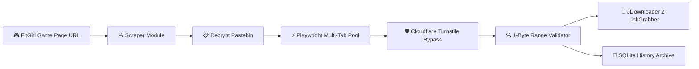

<p align="center">
  
</p>

<h1 align="center">FitGirl Direct Link Extractor</h1>

<p align="center">
  <b>High-speed multi-threaded direct link resolver and JDownloader 2 automation tool for FitGirl repacks.</b>
</p>

<p align="center">
  <a href="LICENSE"></a>
  <a href="https://creativecommons.org/licenses/by-nc-sa/4.0/"></a>
  <a href="https://www.python.org/downloads/"></a>
  <a href="https://flet.dev"></a>
  <a href="https://github.com/vik05h/Link-Extractor/releases"></a>
</p>

---

## 💡 Why This Tool Exists

When downloading large games (like *Black Myth: Wukong* with 195 parts or *Assassin's Creed* with 27 parts), navigating through pastebins and solving Cloudflare Turnstile captchas on every single part takes **30–45 minutes of tedious manual clicking**. 

Furthermore, feeding raw `fuckingfast.co` links to JDownloader 2 often triggers captcha errors (`"External solver required"`) or confusing *"Deep link analysis"* prompts because direct tokens lack file extensions.

**FitGirl Link Extractor automates the entire pipeline:**
1. Paste a single FitGirl game page URL.
2. The multi-tab worker pool automatically solves Cloudflare Turnstile in parallel (~1.8s/part).
3. Outputs **100% verified direct download links** (`dl.fuckingfast.co`) and pushes them straight into JDownloader 2 with one click.

---

## ⚡ Key Highlights



- ⚡ **Concurrent Tab Pool (3x–6x Speedup)**: Resolves multiple game parts simultaneously inside a shared browser context.
- 🎨 **Material 3 UI (Flutter Engine)**: Butter-smooth 60–120 FPS animations, Navigation Rail, live interactive DataTable, and 5 dynamic color palettes.
- 🔍 **Instant 1-Byte Size Validation**: Computes exact total repack download sizes and verifies live filenames using ultra-lightweight 1-byte HTTP range requests.
- 🚀 **Zero-Prompt JDownloader 2 Push**: Dual-channel integration (FlashGot HTTP API on port 9666 + `.crawljob` auto-import) with `#filename.rar` anchors so JDownloader recognizes files instantly.
- 📚 **Embedded History & Archive**: Searchable local SQLite database (`history.db`) for 1-click re-copying and re-pushing past extractions.
- 🔄 **GitHub Releases Auto-Updater**: Built-in update checker that notifies you when new releases or binaries are published.

---

## 📊 Speed Benchmarks

| Repack Game | Total Parts | Manual Browser Time | FitGirl Link Extractor (3 Tabs) | Time Saved |
| :--- | :---: | :---: | :---: | :---: |
| **Starsand Island** | 3 Parts | ~2.5 mins | **~6.2 seconds** | **96% Faster** |
| **Mafia: The Old Country** | 18 Parts | ~14 mins | **~38 seconds** | **95% Faster** |
| **Assassin's Creed: Black Flag** | 27 Parts | ~20 mins | **~54 seconds** | **95% Faster** |
| **Black Myth: Wukong** | 195 Parts | ~1.5 hours | **~5.5 minutes** | **94% Faster** |

---

## 🎮 How to Use

### 1. Paste Your Game URL
Paste any FitGirl game page, pastebin, or raw FuckingFast link:
```
https://fitgirl-repacks.site/black-myth-wukong/
```
The app automatically detects the URL type and fetches mirror links.

### 2. Click "Extract & Resolve"
The multi-tab engine opens concurrent worker tabs, passes Cloudflare Turnstile, and streams resolved direct links into the live table.

### 3. Push to JDownloader 2 or Copy
- Click **🚀 Push to JD2** to send the entire package directly into JDownloader 2 LinkGrabber.
- Or click **📋 Copy All** to paste into IDM, Aria2, or any other download manager.

---

## 🛠️ Installation & Quick Start

### Option A: Run from Source
```bash
# 1. Clone the repository
git clone https://github.com/vik05h/Link-Extractor.git
cd Link-Extractor

# 2. Install dependencies
pip install flet playwright pyperclip

# 3. Install browser binaries (one-time setup)
playwright install chromium

# 4. Run application
python main.py
```

### Option B: Build Standalone `.exe`
```bash
pyinstaller --noconsole --onefile --name "LinkExtractor" main.py
```
The compiled single-file binary will be generated in the `dist/` directory.

---

## 🗺️ Project Roadmap

See [PHASES.md](PHASES.md) for full phase-by-phase development progress:
- ✅ **Phase 1**: Speed & Reliability Core (Multi-tab pool, 2-pass auto-retry).
- ✅ **Phase 2**: Material 3 UI/UX, JDownloader 2 push, 1-byte validation, SQLite history.
- 🟡 **Phase 3 (Next)**: Community Cloud Cache & Shared Link Hub (Firebase).
- ⚪ **Phase 4**: Multi-hoster support (DataNodes, FileKeeper) & CLI automation.

---

## 🤝 Contributing

Contributions, bug reports, and feature suggestions are welcome! Please check [CONTRIBUTING.md](CONTRIBUTING.md) for local dev setup, coding standards, and PR guidelines.

---

## 📜 License & Author Attribution

This project is licensed under the **PolyForm Noncommercial License 1.0.0** (and **CC BY-NC-SA 4.0**).

* **Non-Commercial**: Free for personal, educational, and archival use. Selling, paywalling, or commercializing this software is strictly prohibited.
* **Mandatory Attribution**: Any fork, modification, or redistribution must visibly credit the original author:
  > **Original Author:** Vikash ([@vik05h](https://github.com/vik05h))  
  > **Repository:** [https://github.com/vik05h/Link-Extractor](https://github.com/vik05h/Link-Extractor)

---

### ⚠️ Disclaimer
*This tool is created for educational automation and file archival assistance. It does not host, crack, or distribute copyrighted files.*
