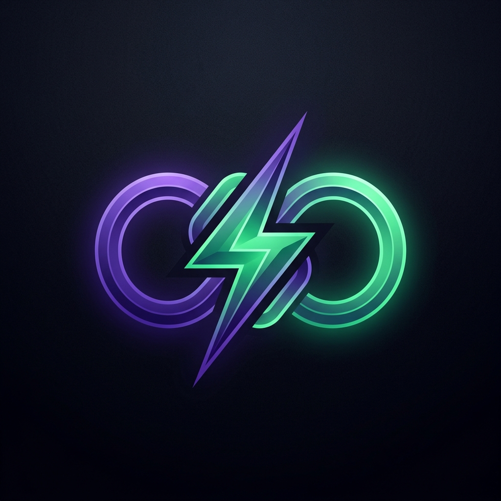
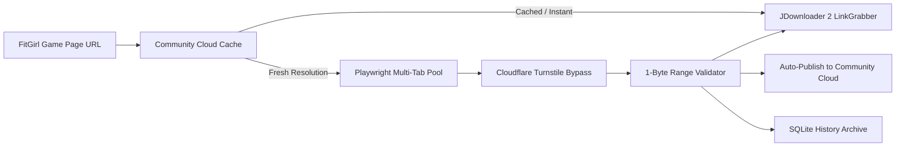
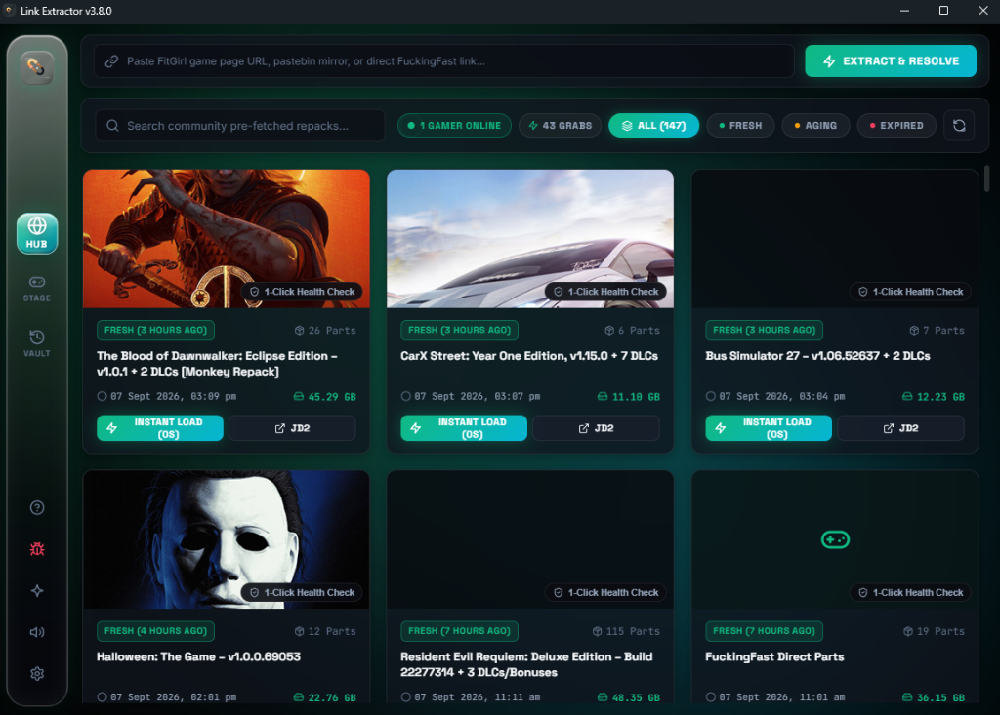

<p align="center">
  
</p>

<h1 align="center">Link Extractor</h1>

<p align="center">
  <b>High-speed multi-threaded direct link resolver and JDownloader 2 automation tool for FitGirl repacks.</b>
</p>

<p align="center">
  <a href="LICENSE"></a>
  <a href="https://creativecommons.org/licenses/by-nc-sa/4.0/"></a>
  <a href="https://www.python.org/downloads/"></a>
  <a href="https://astro.build"></a>
  <a href="https://github.com/vik05h/Link-Extractor/releases"></a>
</p>

---

## Why This Tool Exists

When downloading large games (such as Black Myth: Wukong with 195 parts or Assassin's Creed with 27 parts), navigating through pastebins and solving Cloudflare Turnstile captchas on every part takes 30-45 minutes of manual clicking.

Furthermore, feeding raw fuckingfast.co links to JDownloader 2 often triggers captcha errors or Deep Link Analysis prompts because direct tokens lack file extensions.

**Link Extractor automates the entire pipeline:**
1. Paste a single FitGirl game page URL.
2. Community Cloud Cache automatically checks for pre-fetched links from other users to download instantly in 0 seconds.
3. If not cached or resolving fresh, the multi-tab worker pool automatically solves Cloudflare Turnstile in parallel (~1.8s/part).
4. Outputs **100% verified direct download links** (`dl.fuckingfast.co`) and pushes them straight into JDownloader 2 with one click.

---

## Key Highlights


```mermaid
graph LR
    A[FitGirl Game Page URL] --> B[Community Cloud Cache]
    B -->|Cached / Instant| G[JDownloader 2 / Clipboard]
    B -->|Fresh Resolution| C[Playwright Multi-Tab Pool]
    C --> D[Cloudflare Turnstile Bypass]
    D --> E[1-Byte Range Validator]
    E --> F[Auto-Publish to Community Cloud]
    E --> G[JDownloader 2 LinkGrabber]
    E --> H[SQLite History Archive]
```

- **Interactive Onboarding Guided Tour & What's New (v3.8.0)**: Sequential first-run onboarding displaying release highlights followed by a physical 4-curtain spotlight tour. The tour uses 4 independent backdrop planes surrounding the active element, ensuring zero blur and 100% interactive clickability on target elements without mouse event clipping.
- **Cyberpunk Animated Glassmorphic Dropdowns (v3.8.0)**: Replaced default operating system dropdowns with custom SVG-driven glassmorphic select menus in the Issue Center and export dialogs, featuring category-specific color accents, rotating chevron indicators, and cubic-bezier transition animations.
- **Bandwidth Saver & Selective Download Filter (v3.8.0)**: Automatic categorization of game parts allowing users to toggle English-only audio dubs, skip optional 4K textures, soundtracks, and bonus packs before resolution to save time and bandwidth.
- **Repack Defrag Matrix (v3.8.0)**: Interactive 2D memory visualizer streaming live resolution status across all parts (Queued, Decrypting, Verified, Excluded). Hovering any block displays the filename, size, and status in the HUD with click-to-copy functionality.
- **Real-Time Engine Telemetry (v3.8.0)**: Live terminal feed with responsive auto-scrolling to monitor worker threads, Cloudflare Turnstile token resolution, and HTTP Range checks in real time.
- **Community Issue Center & Smart Duplicate Intercept (v3.8.0)**: Built-in community ticketing board with real-time similarity search to prevent duplicate reports, +1 community upvoting, direct screenshot clipboard pasting (`Ctrl+V`), and secure Admin resolution pin (`0505`).
- **Automated Anonymous Crash Telemetry (v3.8.0)**: Captures unhandled Python exceptions (`sys.excepthook`) and frontend errors (`window.onerror`) with sanitized stack traces sent to Firebase RTDB for rapid bug fixes (opt-out toggle available in Settings).
- **Extraction Vault Archive**: Searchable local SQLite database (`history.db`) for 1-click re-loading into the resolver, re-pushing to JDownloader 2, and clean record deletion with Lucide `trash-2` icons.
- **Community Cloud Cache (Phase 3)**: Instant decentralized link sharing backed by Firebase Realtime Database. If any gamer has already resolved a repack, everyone else downloads instantly in 0 seconds without browser automation.
- **Off-Screen Headed Browser & Background Automation**: Runs browser workers off-screen (`--window-position=-3000,-3000`) to solve 100% of Turnstile tokens without stealing window focus or interrupting your workflow.
- **Zero-Prompt JDownloader 2 Push**: Dual-channel integration (FlashGot HTTP API on port 9666 + `.crawljob` auto-import) with `#filename.rar` anchors so JDownloader recognizes files instantly.
- **1-Byte HTTP Range Size Validation**: Rapidly probes Part 1 and aggregates total repack download sizes without downloading files.
- **GitHub Releases Auto-Updater & In-App Installer**: Startup update checks with automated background download, in-app installation, and release notes showcase.

---

## Speed Benchmarks

| Repack Game | Total Parts | Manual Browser Time | FitGirl Link Extractor (3 Tabs) | Community Cloud Cache (Instant) | Time Saved |
| :--- | :---: | :---: | :---: | :---: | :---: |
| **Starsand Island** | 3 Parts | ~2.5 mins | **~6.2 seconds** | **~0.2 seconds** | **99% Faster** |
| **Mafia: The Old Country** | 18 Parts | ~14 mins | **~38 seconds** | **~0.3 seconds** | **99% Faster** |
| **Assassin's Creed: Black Flag** | 27 Parts | ~20 mins | **~54 seconds** | **~0.3 seconds** | **99% Faster** |
| **Black Myth: Wukong** | 195 Parts | ~1.5 hours | **~5.5 minutes** | **~0.5 seconds** | **99.9% Faster** |

---

## Application Interface

<p align="center">
  
  <br>
  <em>Figure 1: Link Extractor v3.8.0 next-generation cyberpunk gaming hub interface.</em>
</p>

---

## Workflow & Quick Guide

1. **Paste Link & Instant Cloud Detection**: Paste any FitGirl game page URL, Pastebin link, or direct FuckingFast URL. The Community Cloud Cache instantly checks if pre-verified direct mirrors exist for 0-second loading.
2. **Bandwidth Saver & Selective Filter**: Automatically categorize game parts to exclude non-English language dubs, 4K videos, soundtracks, or bonus packs before resolution to save bandwidth.
3. **Multi-Tab Parallel Resolution**: Playwright headless workers solve Turnstile tokens concurrently while streaming live block updates to the interactive Defrag Matrix.
4. **1-Click JDownloader 2 Push or File Export**: Send direct download links straight into JDownloader 2 LinkGrabber (with `#filename.rar` anchors to bypass Deep Link Analysis) or export to `.txt`, `.json`, or `.crawljob`.
5. **Extraction Vault & Community Discovery**: Browse community pre-fetched games in the Discovery Hub or access your SQLite history archive anytime with 1-click reloading.

---

## Installation & Quick Start

### Option A: Prebuilt Windows Executable (Recommended)
Download the latest standalone executable (`LinkExtractor.exe`) from [GitHub Releases](https://github.com/vik05h/Link-Extractor/releases). No Python or Node.js environment is required.

### Option B: Run from Source
```bash
# 1. Clone the repository
git clone https://github.com/vik05h/Link-Extractor.git
cd Link-Extractor

# 2. Install Python dependencies
pip install pywebview playwright pyperclip requests beautifulsoup4 pillow

# 3. Build frontend web bundle (requires Node.js 18+)
cd frontend
npm install
npm run build
cd ..

# 4. Install browser binaries (one-time setup)
playwright install chromium

# 5. Run application
python main.py
```

### Option C: Build Standalone Executable
```powershell
# 1. Compile web bundle
cd frontend
npm run build
cd ..

# 2. Package single-file binary with PyInstaller
pyinstaller LinkExtractor_Single.spec --noconfirm
```
The compiled binary is generated at `dist/LinkExtractor.exe`.

---

## Project Roadmap

See [PHASES.md](PHASES.md) for full phase-by-phase development progress:
- **Phase 1**: Speed & Reliability Core (Multi-tab pool, 2-pass auto-retry).
- **Phase 2**: Material 3 UI/UX, JDownloader 2 push, 1-byte validation, SQLite history.
- **Phase 3**: Community Cloud Cache & Shared Link Hub (Firebase Realtime DB, Pixel Dino loader, 3D cards, local timezone support).
- **Phase 4**: Multi-hoster support (DataNodes, FileKeeper) & CLI automation.

---

## Contributing

Contributions, bug reports, and feature suggestions are welcome! Please check [CONTRIBUTING.md](CONTRIBUTING.md) for local dev setup, coding standards, and PR guidelines.

---

## License & Author Attribution

This project is licensed under the **PolyForm Noncommercial License 1.0.0** (and **CC BY-NC-SA 4.0**).

* **Non-Commercial**: Free for personal, educational, and archival use. Selling, paywalling, or commercializing this software is strictly prohibited.
* **Mandatory Attribution**: Any fork, modification, or redistribution must visibly credit the original author:
  > **Original Author:** Vikash ([@vik05h](https://github.com/vik05h))  
  > **Repository:** [https://github.com/vik05h/Link-Extractor](https://github.com/vik05h/Link-Extractor)

---

### Disclaimer
*This tool is created for educational automation and file archival assistance. It does not host, crack, or distribute copyrighted files.*
